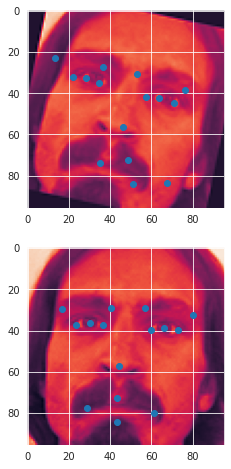
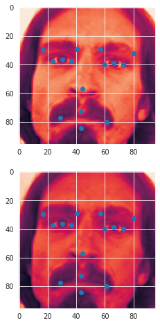

# Facial-Key-Points-Detection
The objective of this task is to predict keypoint positions on face images. This can be used as a building block in several applications, such as:
* tracking faces in images and video
* analysing facial expressions
* detecting dysmorphic facial signs for medical diagnosis
* biometrics / face recognition
* Detecing facial keypoints is a very challenging problem.  Facial features vary greatly from one individual to another, and even for a single individual, there is a large amount of variation due to 3D pose, size, position, viewing angle, and illumination conditions. Computer vision research has come a long way in addressing these difficulties, but there remain many opportunities for improvement.

# Augmentations:-
Used different augmentation techniques. The Critical part was to compute facial keypoints when image is augmented. 

 **Rotation** 
                       **Alter BrightNess**
# Model:-
Fine tunned a pretrained MobileNet Model
~~~
model=tf.keras.models.Sequential([
    tf.keras.layers.Conv2D(3,(1,1),padding='same',input_shape=(96,96,1)),
    tf.keras.layers.LeakyReLU(alpha=0.1),
    pretrained_model,
    tf.keras.layers.GlobalAveragePooling2D(),
    tf.keras.layers.Dropout(0.1),
    tf.keras.layers.Dense(30)

])
~~~
Model achieved a validation accuracy=93%

# Link of Competition
https://www.kaggle.com/c/facial-keypoints-detection/overview/evaluation
